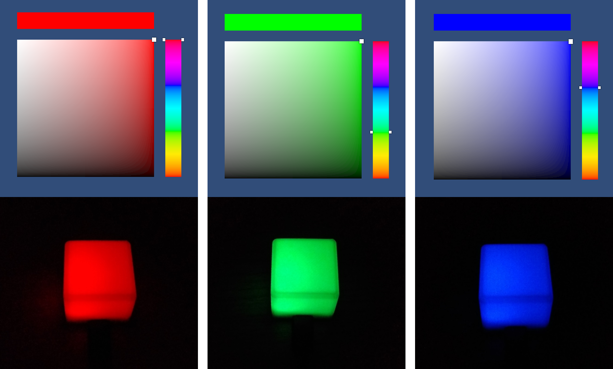

## Use BlinkStick devices in Unity3D with the following benefits
- Specific [BlinkStick .Net](https://github.com/ebadier/BlinkStickDotNet) library allowing maximum compatibility with Unity3D
- A complete test scene to understand the use of the library

## System requirements
Unity ***2017.4.35f1*** and newer versions

## Acknowledgments
[SnapshotGames/cui_color_picker](https://github.com/SnapshotGames/cui_color_picker)